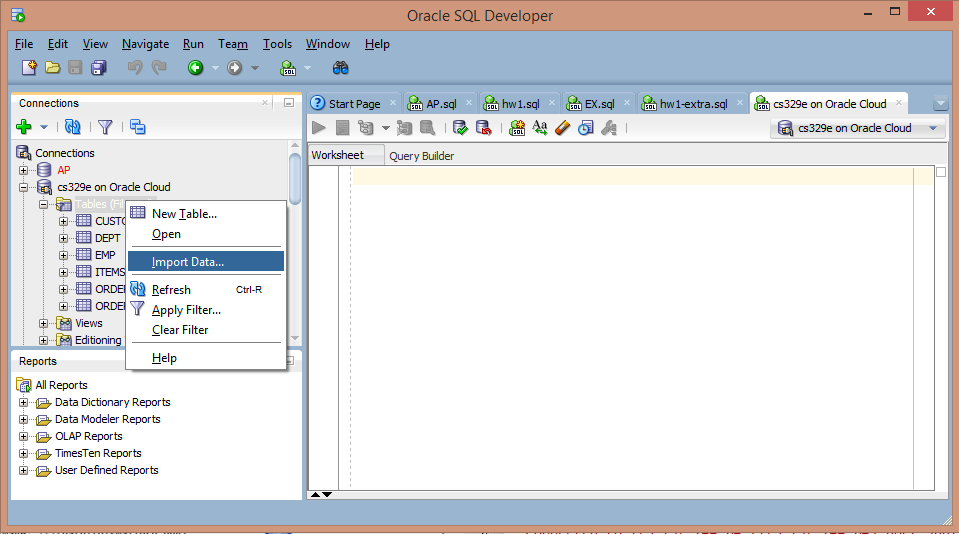
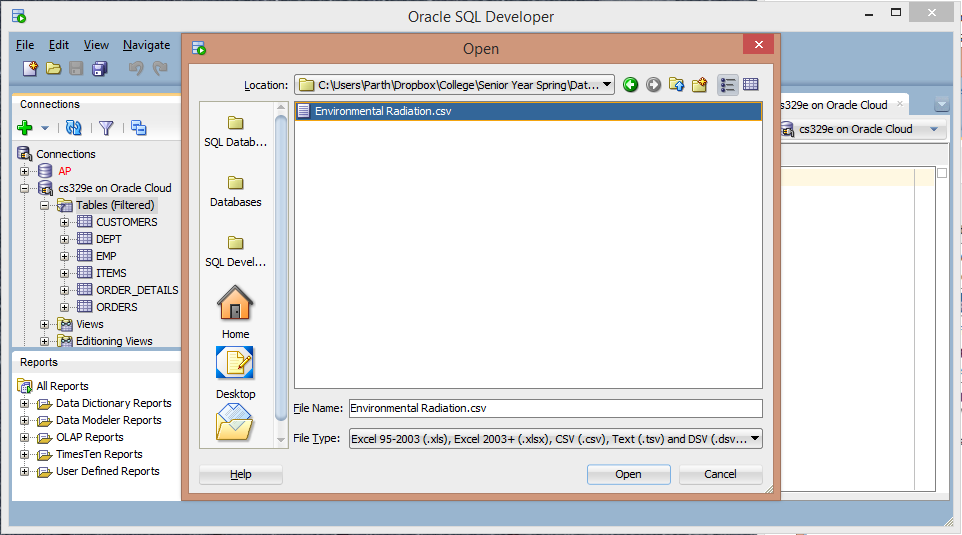
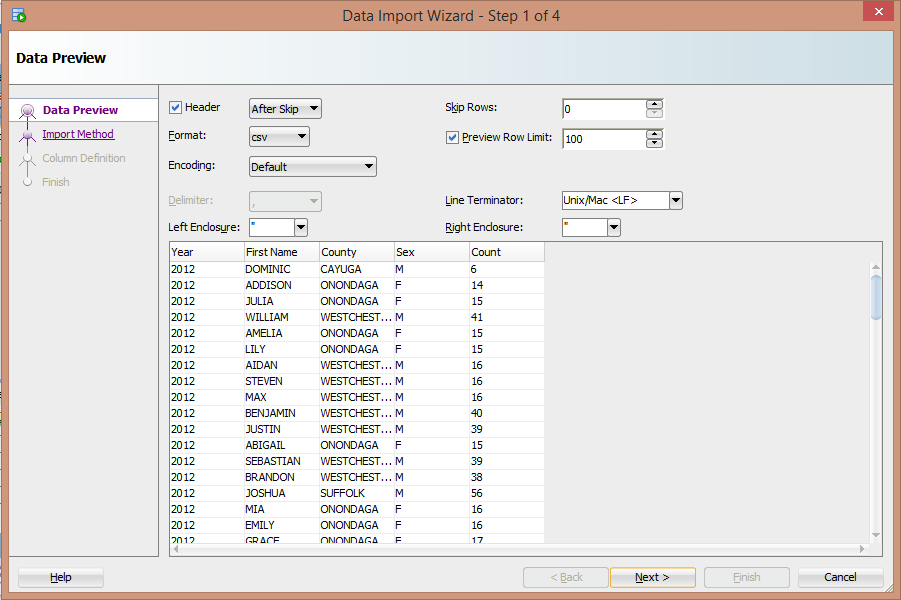

#####Library Calls
```{r, echo = FALSE}
library ("bitops")
library ('ggplot2')
library ('grid')
library ('plyr')
library ('RCurl')
library ('reshape2')
library ('dplyr')
library ('tidyr')
```
***
***

###Importing the Dataframe


#####First, import the .csv file into SQL. 
Click the (+) to access the dropdown file system of the connection in which you would like to import the data.Right click the __Tables__ folder and select the __Import Data__ selection.


Find the .csv file you want to work with and select it for import.



Run through the Data Import Wizard, giving the table a name and identifying the types that each column represent.




Once you are finished with this, the data has been stored in the database.


In our particular case, the data has been stored on a cloud-based database. An SQL query will be used to extract the dataframe from the database for access during the project. The following query is used:

``` 
df <- data.frame(eval(parse(text=substring(getURL(URLencode('http://129.152.144.84:5001/rest/native/?query="select * from rad"'), httpheader=c(DB='jdbc:oracle:thin:@129.152.144.84:1521:ORCL', USER='C##cs329e_anp2222', PASS='orcl_anp2222', MODE='native_mode', MODEL='model', returnFor = 'R', returnDimensions = 'False'), verbose = TRUE), 1, 2^31-1))))
```
***
***

###Environmental Radiation in the State of New York


A subset of the dataframe is shown below.
```{r, echo = FALSE}
source("../01 Data/dataframe.R")

```
```{r}
head(df)
```


This "dataset measures the air, water, milk, and fallout at Background sites around NYS to determine the normal levels of radioactivity and monitors the influence of human activities on these levels. Background samples are collected statewide from several sites which are not expected to be influenced by discharges of radionuclides to the environment. The site numbers represent the location from which samples are collected". 
(http://catalog.data.gov/dataset/environmental-radiation-surveillance-background-site-readings-beginning-2009)

***
***

###Data Wrangling: Making Sense of the Data.

####Data Wrangle 1: Sample Type vs. Level of Radiation (Picocurries/Liter) Faceted by State
This visualization shows the different isotope types based on their sample type and radiation levels, separated by locations. Based on the data, we can see that at the Albany Empire State Plaza (plot 1), there are multiple isotopes found in milk and water, more than in any other location sampled. Also for Albany Health Department (plot 2), we find that air and fallout sample types contain a large variation of isotopes as well. 
```{r}
source("../02 Data Wrangling/data_wrangle1.R")

data_wrangle_vis1
```

####Data Wrangle 2: Location of Sample vs. Amount of Unique Isotopes Present
This visualization presents each location sampled with the unique amount of isotopes present. Here we can see again, in a different perspective, that the Albany Empire State Plaza and the Albany Health Department both have high variation of isotopes whereas all other locations sampled have 3 different isotopes present.
```{r}
source("../02 Data Wrangling/data_wrangle2.R")

data_wrangle_vis2
```

####Data Wrangle 3: Isotope vs. Amount of Samples Taken
This data visualization presents each isotope recorded along with how many samples of each were taken. Each isotope is grouped by the type of sample. Here we can clearly see that for 8 different isotopes, the most amount of samples were taken from water.
```{r}
source("../02 Data Wrangling/data_wrangle3.R")

data_wrangle_vis3
```
